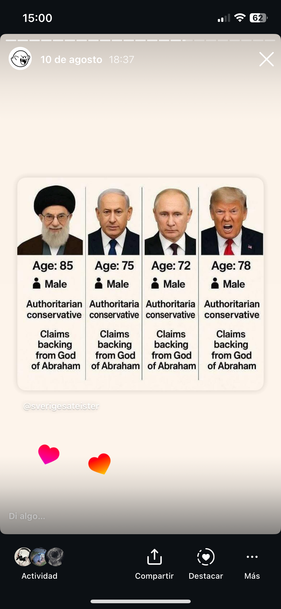
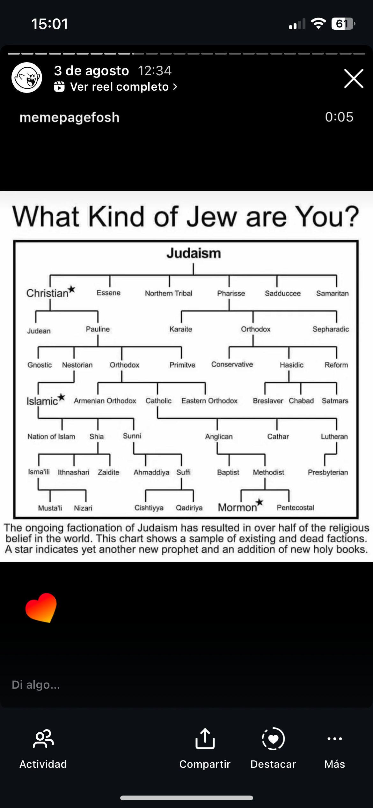

# El tema de las patentes a mí por ejemplo me parece una locura porque…

El tema de las patentes a mí por ejemplo me parece una locura porque es enaltecer el ego

Y como un poco de darle bomba esta cosa de la meritocracia, no como de yo me lo he inventado 

Como si que estoy falaz, porque tú no puedes crear nada de cero 

Estoy hablando a un nivel filosófico y espiritual, aqui el unico artista es dios

entonces yo la frase esta de todo es uno no o un mes no sé, creo que no es la original no  ws wn latin no tengo muy claro el idiomaoriginal 

Pero es algo que recuerdo mucho y que por ejemplo siento que el autoayuda depende de cómo partir de la frase de la base de que nada es de nadie porque todo es de todo y todo en singular porque solo hay uno 

Al que pertenecemos todos, pero la diferencia entre lo plural y lo singular realmente es como algo sin más 

No sé quién lo decía, pero que los números son virus extraterrestres y es que total 

Y entonces a mí hay cosas eso como de la autoayuda de los 10 mandamientos me gusta mucho la cosa de no hagas daño al prójimo porque trata al prójimo como te tratarías a ti mismo, pero que al final si lo reduces más fácil y vuelves al todo es uno es tan sencillo como si tú haces daño al prójimo te estás haciendo daño a ti mismo porque la barrera que separa es una mentira 

Y como que nos creemos mucho estas mentiras, porque siento que vivimos en una época en la que la ciencia lo demostrable y lo observable es lo que rige nuestro conocimiento y nuestra razón 

Y realmente no me quiero poner aquí ni nada, pero la ciencia es un poco una estafa piramidal 

En el sentido de que el método científico es una manera de probar asimismo o sea es como creo que si hago esto va a pasar esto entonces a islas de un contexto súper complejo o genera ilusión de aislamiento 

Y lo haces efectivamente pasa 

O no pasa, y entonces la has liado? 

Pero como que de ahí hemos sacado la cosa de si no lo veo, no lo creo y 

Y como vivimos en un mundo en el que los dioses han muerto o sea realmente la gente no tiene no tiene una educación espiritual y esto es una parte de ti que que está muy jodida 

Y para mí yo lo digo en el mismo sentido en el que por ejemplo yo me acuerdo que de pequeño hicimos un intercambio a Suecia y a nosotros nos volaba la cabeza que tuviesen una clase de cocina y una clase de carpintería y siento que esto debería ser lo mismo sabes una clase en el colegio donde quieras o sea, debería haber una base mínima de conocimientos esotéricos espirituales mediante los cuales tú estés protegida de que te recluten los testigos de Jehová por ejemplo

Que sepas donde te metes cuando te vas a la cienciología y que tengas un poco de contexto y esto es muy complicado, porque es muy difícil generar conocimiento objetivo sobre estas cosas tan complejas 

Pero siento que empezamos a llegar ese momento en el que hay que hacerlo es que hay que hacerlo 

Porque el otro día vi un meme muy bueno voy a ver si lo encuentro y lo pongo aquí

Y que siento que este tipo de Memes, que parecen un poco una tontería y un poco que rozan los problemático son una demostración de que si tenemos el control de alguna manera de del relato 

Y no es un control como perverso, ni ni castrador ni nada, sino simplemente es la cosa de que tú puedas ver un poco cuando alguien dice según qué cosa que puedas tracearlo

por ejemplo, para mí los israelíes son un ejemplo de esto es hemos cedido la educación de un grupo de gente bastante grande hasta el punto en el que hay soldados que están lavados el cerebro pensando que la gente que vive en Palestina es mala 

Que es como en qué momento sabes me rompe el corazón cuando veo Reels yo el otro día había uno también de una chica creo que era una chica no femenina que se acercaba un tío grabando y le decía eh tú tú eres un soldado israelí te sienta bien matar niños en Palestina 

Y este hombre le decía que sí, y que mate más y mejor más o menos 

Y claro, yo digo guau esta gente o sea o de o sea yo soy un poco partidario de de poner límites o sea hay veces que la reinserción es muy costosa y cuando el peligro es inminente a veces siento que es mejor pum pum  que seguir permitiendo que se masacre gente, pero

Ya empiezan a ver noticias de soldados israelíes que se dan cuenta lo que han hecho y por ejemplo uno se suicidó es que esto es una pelota que al final caerá porque la verdad es una y es muy sencilla 

Y es que todo es uno 

Hasta incluso las diferentes religiones habrá Mika's como no sé si está bien el término  aqui pero

cuando te pones a salir algunos textos, que yo nunca lo he hecho desde un enfoque académico ni profesional, y yo voy más saltando de cosas que me parecen interesantes 

Te das cuenta que al final es una especie batiburrillo, mezclado que eso es lo que es todo o sea todo es uno 

Y ya está 

No hay más 

