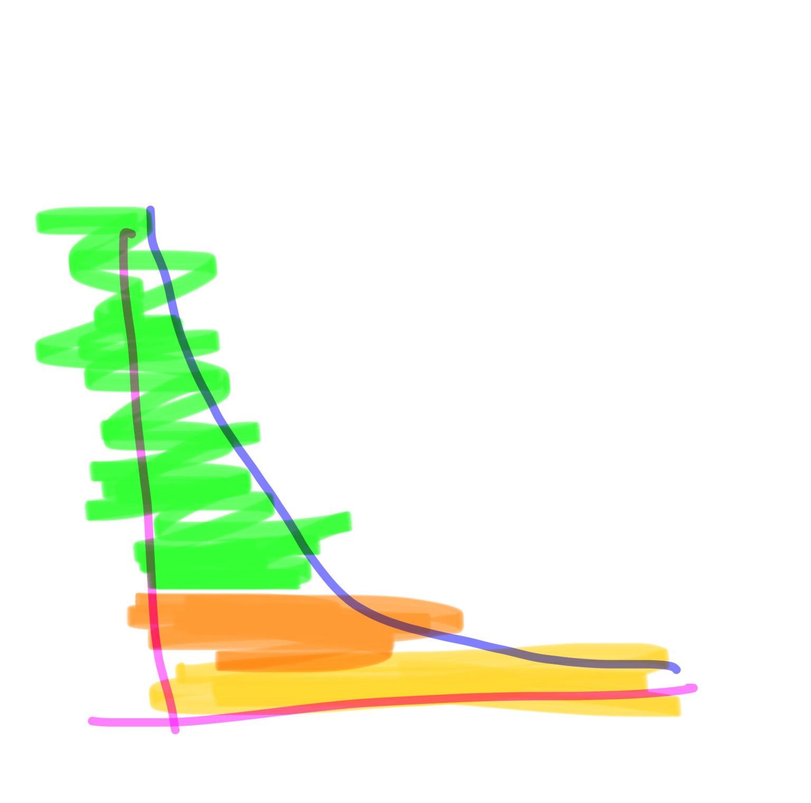

# Y a mí me gusta mucho jugar

Porque el juego te permite mucho el liberarte de de muchas cosas, entre ellas del cringe

Cuando juegas alguna manera pierdes el ego

Y por eso hoy le decía camille que probase a llamar de usted y a llamarla Osi al profe, porque yo empecé jugando y realmente hay un momento en el que cuando estás jugando muy bien ya estás dentro

Y estás dentro sin apariencias estás dentro totalmente no estás dentro como tú si no estás dentro como jugador

Y me gusta mucho jugar con gente, porque cuando la gente juega puedes ver realmente que como son no o sea porque en el juego es cuando se permite todo

Al final las drogas son juegos también solo que son juegos bastante peligrosos, pero bueno hay gente adicta juegos peligrosos, o sea tirarse de una montaña en una moto a no sé cuántos por hora es un juego es peligroso

Y también es peligroso el choco choco lala choco choco tete

Y yo hay muchas cosas como el tema de tener un respeto a la gente mayor, que empecé jugando porque dije voy a jugar este juego

Y vi que me gustaba, entonces fui jugando lo más y llega un momento en el que cuando estás jugando una cosa

Yo también de esto, aprendí mucho en un taller buto

Que fue un taller traumático al que fui con uno de los mejores rollos que he tenido jamás. Yo diría

Y me acuerdo que te pedí hacer una escena en clase y yo no podía me daba mucho pánico escénico y el profesor me obligó, pero me obligó de una manera como que estaba jugando conmigo

. Él sabía que lo que yo estaba viendo era algo serio, y sabía hasta dónde podían empujarme y hasta donde no 

y el silencio es una cosa brutal

De hecho como una de las mayores pena, yo siempre pienso en esto en el sistema penitenciario actual es el aislamiento que se acerca al silencio es que te vuelves loco

Y no me acuerdo qué hice y estuve media hora que no podía hablar y luego se me pasó

Pero en ese taller aprendí mucho lo que significaba jugar no había como muchos ejercicios de danza contemporánea, no sabría cómo decirlo en los que se proponían juegos y tú tenías que jugar con otra persona y eso encuentros pues eran como un inicio un nudo y un final

Y es que la vida es todo eso o sea la vida es eso muchísimas veces de verdad es que esto es la vida

Solo que hay juegos, a los que parece que no te puedes negar como pagar el alquiler

Y depende del país en el que vivas las normas son distintas

Y serán distintas también dependiendo de el momento en el que vivas en un lugar determinado no porque pensamos mucho en los territorios ligados a países pero realmente España ha sido 700 años musulmana o sea se nos olvida muchísimo esto pero es que hemos sido más tiempo musulmana que romana

Y la cantidad de tiempo que hemos sido celtíbero

O sea hay tela es verdad que cuanto más alejada son las temporales menos afectan y es logarítmico o sea lo que está muy cercano te afecta muchísimo mientras que lo que está a medio largo distancia te afecta poco

Pero realmente es acumulativo entonces lo que más tiempo está durante el tiempo siempre es la la parte baja del gráfico no sé cómo explicarlo mejor

cómo que si ese gráfico logarítmico 

Si cuentas el área realmente la parte inferior tiene muchísimo volumen

Y esa parte inferior, lo que al final ha estado más tiempo en un lugar que parece mentira, pero que los lugares de verdad se conforman muchísimo en el tiempo

Y cuando tú ves que encima debajo de tu casa hay capas y capas y capas de ciudades totalmente distintas, pero tu punto geográfico en el tiempo

Que ha visto y cuando pensamos en el tiempo como una ilusión, porque al final siempre vuelvo como a ideas no, pero cuando juego y este estoy pensando y juego la carta del alma única

Que es como esta teoría de que realmente somos un mismo alma que va pasando por distintos espacios y tiempos, pero que o sea sabes que en algún momento yo me reencarnaré en ti o sea y pues depende de quien lo piense hay gente que piensa que aleatorio hay gente que piensa que vas progresando hay gente que tiene objetivos en esto hay gente que no

Como los budistas que se quieren liberar del ciclo

O los taoistas que se quieren disolver en él

Me lo invento todo un poco eh, pero al final los cristianos pues bueno sus movidas