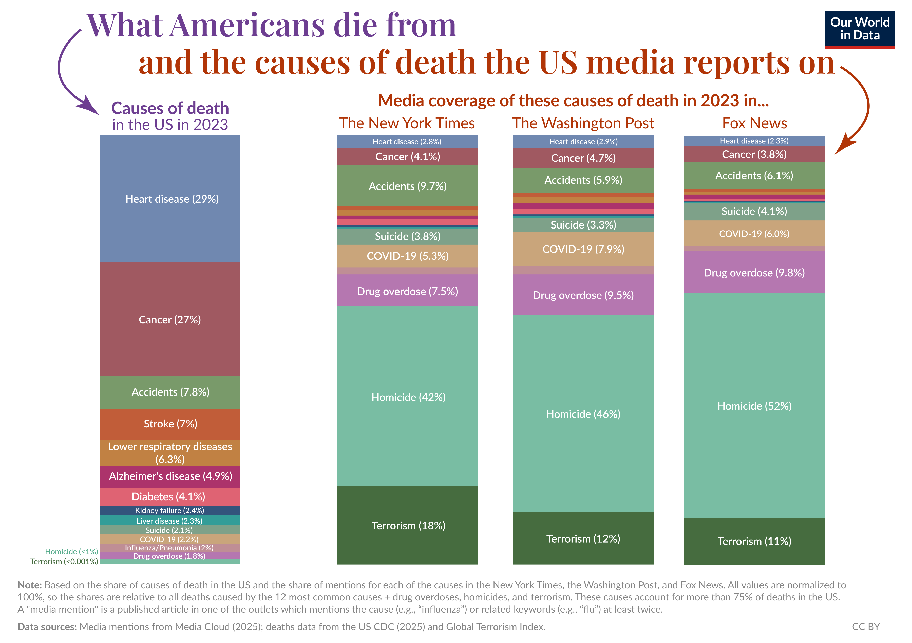

# Y algo que ya no sé si es intuición creo que no, pero es una coincidencia…

Y algo que ya no sé si es intuición creo que no, pero es una coincidencia que veo que me parece muy interesante y es como hoy en día parece

Que es la gente que viene de climas más duros más del norte, con un invierno más frío un verano como igual excesivamente cálido como de lugares donde no nos gustaría vivir o sea porque parece que la mejor calidad de vida está en países de Europa donde es que no apetece vivir en planta, da mucho palo y como la

Como los lugares con el clima más apetecible, como son lugares a los que van depredadores literal de otros climas, no como hoy hemos visto lo que pasa con introducimos especies en un clima donde están como chetadas

Y en el medio ambiente hemos empezado a cuidar eso hace muy poco es que de verdad el mundo en el que vivimos es muy reciente por eso es tan extraño

Y yo creo que es por eso que no ha parecido tantas tantas tantas patologías mentales porque hay muchísima gente se está mezclando la gente con corporalidad distintas con emocionalidad dades distintas con mentalidades distintas y con espiritualidad dades distintas

En un mundo, que solo tiene 100 años y que está construido a partir de depredadores

Que claro, volviendo al tema de las mitologías hay dos tipos no y está la que viene de observar los ciclos y la que viene de activamente oprimir los extraerlos no al igual que hay dos tipos de animales, los que comen plantas los que comen  animales y los que les da igual

Y como por ejemplo los reyes comían tanta carne, algo que hacen los depredadores

Y muchas veces morían de eso, que era un meme que muriesen un rey de gota

Al igual que hoy en día muchísima gente muere de cosas por la sociedad en la que vivimos, o sea

El suicidio es una causa de muerte y es de una imposibilidad de recuperar el equilibrio interior y es esto y yo al hablarlo de esta manera tan espiritual no lo estoy restando importancia si no se la estoy dando incluso más es en plan muere mucha gente suicidada

me hace mucha gracia esta gráfica, porque de verdad que la cantidad de gente que vemos que muere matada por otra persona en la tele versos, la cantidad de gente que muere así realmente y la cantidad de gente que muere por problemas en el corazón

Que nuevamente recordemos que es como la la imagen principal de uno de los cuatro tipos de personas que dió Jung

Pero que también es uno de los cuatro elementos como en los que pensamos siempre en occidente y que por ejemplo me parece muy interesante cuando yo por esto y yo creo que es por esto por lo que tengo tanta esperanza eh

Pero cuando algo así, se intenta tapar el yin es que emerge

que de verdad que el mundo tiene el equilibrio que por ejemplo en España franco quiso erradicar la izquierda y que no lo ha hecho que las nuevas generaciones volvemos a ser un un foco de esperanza y hemos tardado dos o tres generaciones en recuperar la esperanza, pero que yo creo que hoy en día tenemos gente chulísima de de de de mi edad y mucho más joven y que gente con las ideas muy claras y muy buenas ideas

Y yo creo eso y yo cuando meto piensa en esta imagen y pienso traerla más al mundo sabes y no lo estoy poniendo como que yo soy un santo ni que haya provocado nada lo que está pasando simplemente yo os invito de verdad

Poco a poco, sin con la hipocresía, que puede aparecer que estés dejando de de actuar en otras situaciones, porque no es para nada eso o sea sigue habiendo un genocido en Palestina

Y siguen habiendo cosas contra las que tenemos que luchar no podemos encerrarnos en un convento a pensar en dios, porque volveremos a caer en el desequilibrio

Que tú sepas que tú vas a ganar que vas a ganar balance y yo creo que en el momento en el que conseguimos traer esta calma y decir no no no es que la calma es mi estado natural y es el que vuelvo que antes era dios y para mucha esta gente es una versión del cristianismo muy rara que yo de verdad yo te digo

Que estemos permitiendo que haya un país en este mundo, porque lo decía un libro de hace 3000 años es una locura y no solo es una locura, sino que nos demuestra en lo que se ha convertido el cristianismo y la ciencia

Que es que solo hay una verdad y la verdad es material y entonces hay gente que que se está pensando en si Cristo existió de verdad o no o dedicando toda su vida a ello, pero no desde el disfrute que lo pueda hacer un una académico no estoy diciendo que el académico sea mejor por un tema de alfabetización

Sino que la académico decide meterse en eso

Hay gente a la que le va la fe en ello y precisamente eso no es la fe la fe es comprender lo que nos dice más allá el relato de Cristo y y lo digo no como un o sea soy una persona que ha crecido siendo cristiana pero que ahora yo ya no te sabría definir en qué creo en una especie y me dice cola lanza de todas las religiones a las que tiene acceso gracias a la tecnología que tenemos ahora porque antes también era muy difícil atar según que cabos

Quiero decir, de verdad que yo soy una persona superdotada, sino que soy una persona simplemente que hace 34 años paró y paró y conseguí parar y conseguí parar también gracias a que conseguí una especie de renta básica universal que es el paro que me permitió parar y y cómo tomar las decisiones que necesitaba tomar, porque nunca había podido

Porque todas mis mi historia de vida es ir en un coche que que condujo mi padre hasta los 25 años más o menos

Y en ese momento me desperté y dije ay yo yo no creo que no creo que no quiero estar aquí pero en ningún momento se me ha consultado ni siquiera se me ha permitido que me imagine la posibilidad de consultármelo

Y es esa época en la que vivimos o sea vivimos de una crisis de imaginación es eso y no es otra cosa y quien te diga que es otra cosa te miente

Porque yo como ese último eslabón entre los Millennials y los GenZ que soy yo he vivido eso de que tus padres te digan que no tiene salida las letras o que te vean y piensen que eres un perdedor porque vas a estudiar algo que no te va a llevar a ningún sitio

Y yo en plan, pero esto no tiene sentido que me estás diciendo si esto es chulísimo y esto está estudiado muchísimo que de verdad que hasta hace 150 años tú no podías tener un doctorado en medicina sin saber leer latín y que era algo obvio evidente

La manera que tenemos de alinearnos frente a la obviedad

Y cuál es la unidad que se nos está presentando hoy en día y como nos alineamos frente a ella es esa frase es que es muy buena frase

Y me salió en un meme, o sea es muy fuerte

598