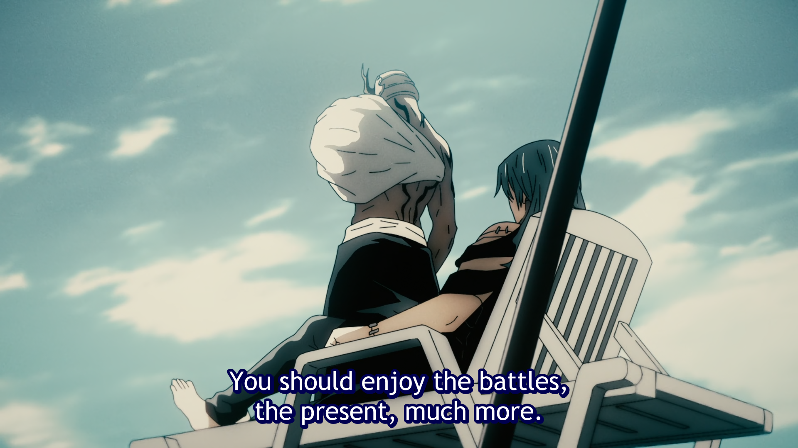

# los shonens son

danza conteporanea con energía

toma la fotma de poderes la energía
y cómo los seres vivos interactuan cone lla

tomando una pelea comk la maxima expresion de ello: las dos realidades (Personal reality) luchando entre si

igual el sexo es lo más oparecido que tenemos a lo que podemos sentir 
con todo

la muerte antes de la muerte, parménides, la petite mort en francés
la sensación que tiene una maldición

en una batalla

una maldición es una realidad
lo mismo que lo es una bendición, 
cualquier ilusión 
y cualquier apariencia

es como ese sí y ese no que te revienta
es la espectativa de que todo sea "como tiene que ser"
es la incomodidad ante el silencio y la contemplación
la serpiente que sisea

y lo que rodea a una maldición son sus mitos
imágenes que usa para modificar la realidad

y por eso explicarlos los activa y potencia
abracadabla

los shonens hablan de algo que hoy no entendemos
que es la pulsión heróica por la aventura
y si se corta su activacións se cancelan