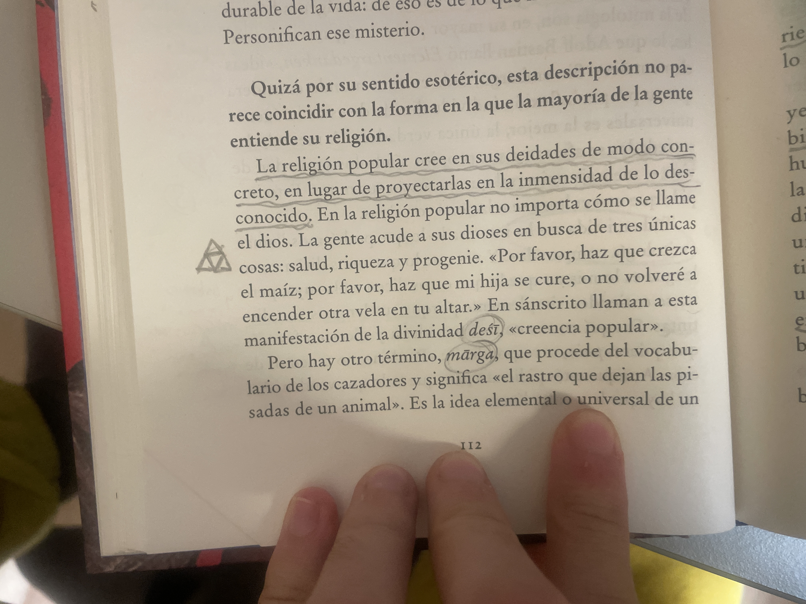

# pero luego yo entiendo que hay como dos maneras de ser moderna, no…

pero luego yo entiendo que hay como dos maneras de ser moderna, no que es ya sea por capital económico, pero la gente que es moderna por capital cultural como que le cuesta mucho admitirlo

En plan sí que puede ser que tu padre no tenga más de seis o siete cifras en el banco pero si tu madre es pianista ya tienes un adelanto increíble en todo lo que vas a aprender de la vida a una edad muy temprana

Y esto es algo que como vimos en ese día meritocrática la gente que lo tiene esta ventaja no la oculta, pero de alguna manera como que se le hace injusto admitir que es una ventaja 

de la misma manera que a la gente con dinero se le hace injusto admitir que es una ventaja, pero como que ya empezamos a ver que eso es una evidencia

pero salirse la norma para mí es en cierto modo acumulativo y es algo que tú puedes heredar y el poder de poder relacionarte con el mundo de una manera específica no y poder salir de la del pensamiento de de que la vida solo el trabajo o de que dios no existe o de que hay que seguir las normas sociales, el poder plantearte eso en si ya es una ventaja que tienes con yo siempre me imagino

A una señora de 40 años, trabajando en alguna tienda de Retail, de Fast Fashion

No puede decir nombres, pero imaginados la que más os apetezca yo siempre pienso en Sara la verdad pero no porque el Sara trate mejor a sus empleadas, sino porque es una cultura de trabajo muy específica

Donde se asumen unas violencias que a mí por ejemplo me empecé a dar cuenta cuando trabajaba y yo les preguntaba y la gente estaban en un entorno en el que eso no se pensaba entonces yo le decía a mi jefe por ejemplo que a mí me parecía injusto que yo tuviese una jornada partida, pero que esa hora en la que yo estoy comiendo y estoy descansando y preparándome para el siguiente turno de trabajo yo no lo cobre porque son unas horas que tampoco son mías

O que el tiempo de Transporte al trabajo no está incluido en la paga porque yo en ese tiempo si no lo estoy cobrando porque lo estoy trabajando si no lo estuviese trabajando estaría en otra cosa

Y yo soy una persona muy ansiosa, que yo creo que hoy en día todo el mundo lo es porque me doy cuenta de la brevedad que es la vida y de que llevo muchísimo tiempo o sea yo creo que hasta que termine la carrera en una situación de maltrato psicológico con mi familiares y mi padre en particular y es una situación de la que tampoco le puedo terminar de culpar, porque él tampoco es consciente del año que está haciendo, pero yo he empezado a vivir realmente con 25 26 gracias también a un ex que me dió un empujón increíble y que yo le quiero muchísimo o sea nunca volveremos a estar juntos pero yo le estaré eternamente agradecido a esta persona

Al igual que lo estoy a muchísima gente que ha estado por mi camino, pero solo ahora me empiezo a dar cuenta de

De por qué? Yo siempre he querido hacer música y llegó un día en el que no puede hacerla hasta o sea que aún sigo ahí pero que es un viaje pero tengo el privilegio de poder permitirme este viaje

Una niña Palestina no lo puede, no se lo puede permitir porque no sabe si mañana va a seguir viva o no o sea que yo tampoco en cierto modo pero de una manera muy distinta

Y yo cuando digo que la renta básica universal es al final la solución a todos los problemas también es por esto porque nos permitirá dejar de estar luchando por las migajas porque aunque seas una pija económica y una vieja cultural seguís siendo gente que sufre en este mundo no y como

Como que con eso lo enlazo con lo del machismo, como que yo entiendo que estés enfadada porque cuando yo me he dado cuenta de cosas a una edad muy tardía te jode porque el tiempo es algo que no vuelve o sea el tiempo fluye y todos estamos en un constante flujo de un sitio hacia otro y sabes la vida y la muerte no son sino momentos singulares que tiene el alma única que es el alma que tenemos todos que cuando la vemos así como más perteneciente algo superior lo pensamos como espíritu y yo creo que alma es algo como más traducido al cuerpo no de hecho siempre pensamos no como

Cuerpo mente al alma espírito

Tierra aire, agua fuego

Físico mental emocional espiritual

Si en este orden entonces yo creo que realmente al final todos somos una emanación de algo que no podemos explicar, pero que es que es una y no 51 sabes y que cuando te das cuenta de que es lo que la persona que tienes delante está consiguiendo es algo que tú en un tiempo distinto, y no el espacio distinto, también conseguirás o has conseguido y que sabes que no hace falta que te pelees con la persona delante porque solo lo único que estás haciendo es además hacerte daño a ti mismo en otro tiempo y en otro espacio

Yo lo entiendo como que es una manera de de hacerte una paja, pero que estás haciendo con una especie de montaña de semen que en algún momento se te va te la vas a tener que comer sabes no sé esto hace un poco de gracia

Tú estás ahí llenando una cosa, en lugar de respirar, ver, mirar, oír escuchar y decir vale dónde tengo que ir

Estaba leyendo las definiciones estas de desi y Marga

Y yo cuando digo que quiero una renta básica universal, es para permitirnos que todos estemos en el marga ya que no haya que pasar por el desi que el desi sea aquello que elijamos

Y que ya libre mercado gestionará los precios de las cosas cuando la gente sea libre efectivamente de poder decidir en qué trabaja y en que no

Y que esos extras sean limitados de alguna manera, sabes que haya un límite de la cantidad de dinero que puedas tener

Pero tan pero global integral y que si hay gente que de repente tiene que deshacerse mucho no pasa nada les damos un tiempo también para que ellos hagan el duelo que necesiten con la materia

Pero que pasen que pasen página no no puede ser que tú tengas cinco coches de lujo

Y 20 viviendas vacías

Mientras que tu vecinos está muriendo de hambre en una cuneta con media pierna infectada, porque tiene una herida que no se puede curar porque no no hay ningún sitio donde se pueda curar

Que no tiene espacio para dejar las cosas

A mí me cambió algo el momento en el que entendí el zodíaco como un poco el viaje del alma no como el primer respiro las primeras pertenencias, la primera como identidad social la primera familia la primera mitología podría ser Leo las primeras creaciones, las primeras emanaciones pudieran servir también la justicia y la muerte

Y cuando llegamos a los cuatro finales hay como un ambiente espiritual, no porque sagitario es como la filosofía. Capricornio es como el orden social acuario es como el la autoridad y piscis es la totalidad

Y luego, Aries vuelve a ser la causa primera

Y que al final todo el mundo pasa por todo solo que necesitamos el tiempo y el espacio adecuado y hoy en día hay mucha gente a lo que no les estamos permitiendo esto o sea que son esclavos realmente

Y yo hasta que esto no lo solucionemos es que paralizaría todo y que la gente tenga vida digna que ya está que si nos viera invadir Estados Unidos pues que nos invade pero que si nos invade que que no sé qué luchemos hasta la muerte porque es que la muerte no es sino otro estado de la vida es una manifestación es una protesta

pero no es tan una despedida como lo pensamos simplemente es un cambio de estado el hielo sigue estando en contacto con el agua sabes y el aire es una masa indefinida que abarca todo en absoluto con aquello con lo que toca, pero a la vez no no como la herramienta de Photoshop de la varilla mágica, es un poco el aire no como lo abarco no lo abarco no sé qué

